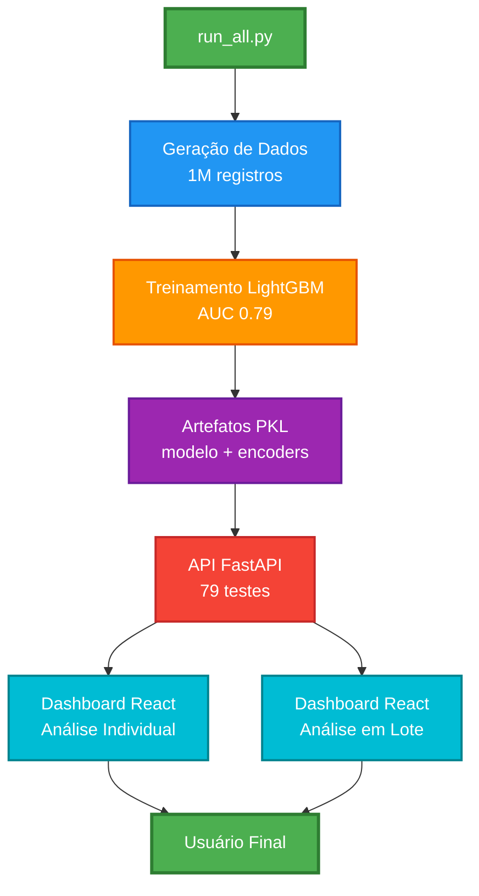
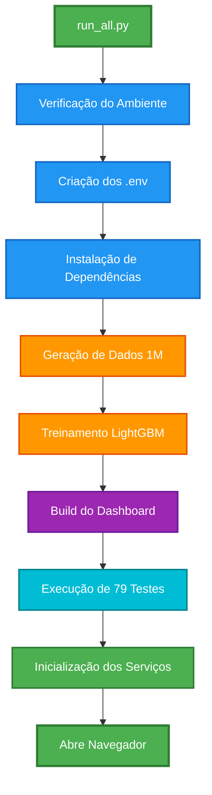
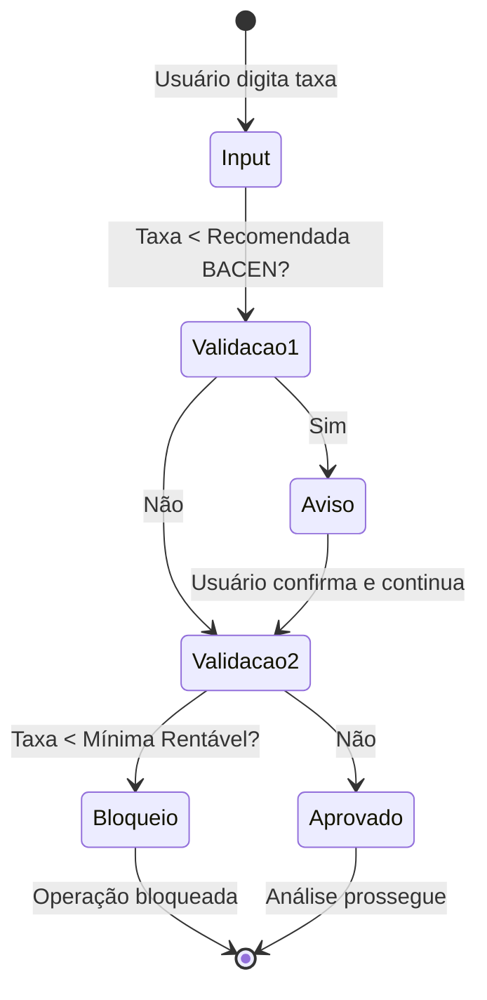
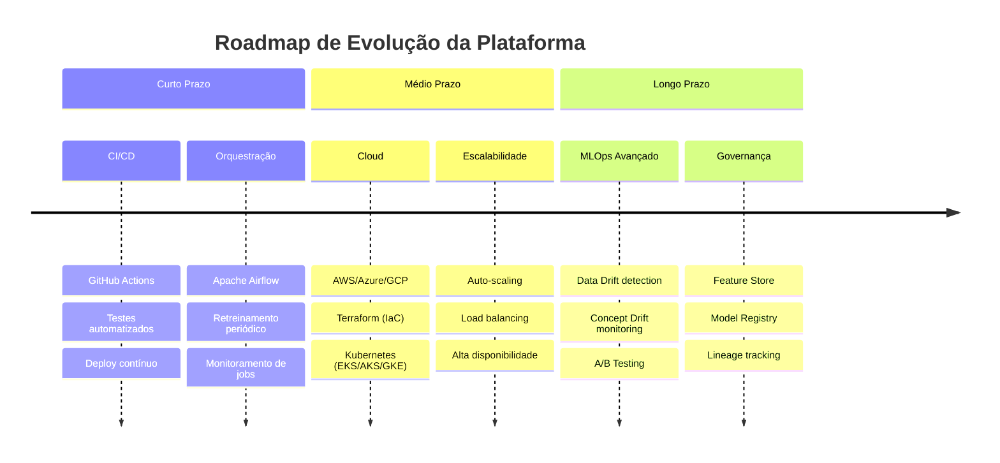

<div align="center">

# 🏦 Santander Credit Risk Platform

### Plataforma Enterprise de Machine Learning para Análise de Risco de Crédito

<br>

[](https://www.python.org/)
[](https://fastapi.tiangolo.com/)
[](https://react.dev/)
[](https://www.typescriptlang.org/)
[](https://vitejs.dev/)
[](https://tailwindcss.com/)

<br>

[](https://lightgbm.readthedocs.io/)
[](https://scikit-learn.org/)
[](https://pandas.pydata.org/)
[](https://numpy.org/)

<br>

[](/api/tests)
[](https://www.bcb.gov.br/)
[](README.md)

</div>

---

## 📋 Índice

- [Visão Geral](#-visão-geral)
- [Demonstração do Sistema](#-demonstração-do-sistema)
- [Objetivo do Case e Valor de Negócio](#-objetivo-do-case-e-valor-de-negócio)
- [Arquitetura de Solução](#️-arquitetura-de-solução)
- [Plano de Implementação](#️-plano-de-implementação)
- [Reprodutibilidade da Arquitetura](#️-reprodutibilidade-da-arquitetura)
- [Screenshots do Sistema](#-screenshots-do-sistema)
- [Melhorias e Roadmap](#-melhorias-e-roadmap)
- [Documentação Adicional](#-documentação-adicional)

---

## 🎯 Visão Geral

> **Plataforma de Machine Learning enterprise-grade para análise de risco de crédito, totalmente automatizada com um script de execução universal (`run_all.py`). A solução integra um modelo LightGBM de alta performance (AUC 0.79), uma API FastAPI robusta e um Dashboard Premium em React, demonstrando um ciclo de MLOps completo, desde a geração dos dados até a implantação e o teste, com foco em conformidade regulatória e rentabilidade do negócio.**

### Destaques do Projeto

<div align="center">

| **Automação** | **ML Model** | **API** | **Dashboard** | **Conformidade** |
|:---:|:---:|:---:|:---:|:---:|
| `run_all.py` | **LightGBM** | **FastAPI** | **React + TS** | **BACEN 2682/99** |
| Setup em 1 comando | AUC **0.79** | **79 testes** | Análise Individual | Taxa Mínima |
| Cross-platform | **21 features** | Swagger Docs | Análise em Lote | Provisão |

</div>

> [!IMPORTANT]
> Este projeto foi desenvolvido para a **Banca do Santander** e demonstra um ciclo completo de MLOps, desde a geração de dados até a implantação em produção.

---

## 📋 Demonstração do Sistema

### Análise Individual - Crédito Aprovado

<div align="center">


**Análise individual com resultado de crédito aprovado**

</div>

### Análise Individual - Crédito Negado

<div align="center">


**Análise individual com resultado de crédito negado**

</div>

### Análise em Lote

<div align="center">


**Processamento em lote de múltiplas propostas com upload de arquivo CSV**

</div>

---

## 🎯 Objetivo do Case e Valor de Negócio

### Valor de Negócio Mensurável

<div align="center">

| Métrica | Valor Alcançado | Impacto no Negócio |
|:-----------|:-------------------|:----------------------|
| **Automação do Setup** | 100% com `run_all.py` | **Time-to-Market Reduzido**: Qualquer desenvolvedor pode ter o ambiente 100% funcional em minutos, não dias. |
| **Inteligência de Taxas** | Baseado em dados do BACEN | **Rentabilidade Otimizada**: A taxa mínima rentável, calculada com base no risco real e custos operacionais, evita prejuízos. |
| **Qualidade do Código** | 79 testes automatizados | **Redução de Riscos e Bugs**: Garante a estabilidade da API e a confiabilidade das predições. |
| **Performance do Modelo** | AUC-ROC > 0.79 | **Decisões Mais Precisas**: Aumenta a capacidade de identificar bons e maus pagadores, reduzindo a inadimplência. |
| **Conformidade** | Resolução CMN 2.682/99 | **Segurança Regulatória**: O cálculo de provisão e as taxas estão alinhados com as normas do BACEN. |

</div>

---

## 🏛️ Arquitetura de Solução

### Fluxo de Dados e Processamento



### Componentes Técnicos

<details open>
<summary><b>Clique para expandir/recolher a tabela de componentes</b></summary>

| Componente | Tecnologia | Responsabilidade | Justificativa da Escolha |
|:--------------|:--------------|:--------------------|:----------------------------|
| **API de Predição** | **FastAPI** | Orquestrar o fluxo de predição, aplicar regras de negócio, gerenciar segurança e servir o modelo de ML. | Altíssima performance (assíncrona), validação de dados nativa com Pydantic e geração automática de documentação interativa. |
| **Dashboard Premium** | **React (Vite) + TypeScript** | Fornecer uma interface rica, moderna e interativa para a análise de crédito, com componentes reutilizáveis e performance otimizada. | Ecossistema maduro, componentização, performance superior e flexibilidade para criar UIs complexas e profissionais. |
| **Modelo de Risco** | **LightGBM** | Realizar a classificação de risco de crédito com alta precisão e baixa latência. | Performance superior em dados tabulares, eficiência em memória e velocidade de treinamento, ideal para o cenário de crédito. |
| **Testes Automatizados** | **Pytest** | Garantir a qualidade, a estabilidade e a confiabilidade da API, com uma suíte de 79 testes cobrindo diversas camadas da aplicação. | Simplicidade, ecossistema rico em plugins e padrão de mercado para testes em Python, facilitando a manutenção e a evolução do código. |
| **Script de Automação** | **Python (Padrão)** | Orquestrar todo o ciclo de vida da aplicação: setup do ambiente, geração de dados, treinamento do modelo e inicialização dos serviços. | Linguagem universal e de fácil manutenção, permitindo a criação de um fluxo de trabalho complexo e à prova de falhas. |

</details>

---

## ⚙️ Plano de Implementação

### Automação Universal com `run_all.py`

> [!TIP]
> O principal diferencial do projeto é o script **`run_all.py`**, que automatiza **todo o ciclo de vida da aplicação** em um único comando, garantindo a **reprodutibilidade da arquitetura** em qualquer ambiente.



<details open>
<summary><b>Clique para ver a tabela detalhada de passos</b></summary>

| Passo | Ação | Propósito |
|:--------:|:--------|:-------------|
| **1** | **Verificação do Ambiente** | Detecta Python, Node.js e gerenciadores de pacotes disponíveis no sistema. |
| **2** | **Criação dos Arquivos `.env`** | Gera arquivos de configuração com segredos e variáveis de ambiente necessárias. |
| **3** | **Instalação das Dependências** | Instala todos os pacotes necessários via `pip` e `pnpm`/`npm` automaticamente. |
| **4** | **Geração de Dados Sintéticos** | Executa `scripts/gerar_dados_REALISTICOS.py` para criar o dataset de treinamento realístico (1 milhão de registros). |
| **5** | **Treinamento do Modelo** | Executa `scripts/treinar_modelo_PREMIUM.py` para treinar o modelo LightGBM e salvar os artefatos (PKL). |
| **6** | **Build do Dashboard** | Compila a aplicação React (`dashboard_premium`) para produção com otimizações. |
| **7** | **Execução dos Testes** | Roda a suíte completa de 79 testes `pytest` para garantir a integridade da API. |
| **8** | **Inicialização dos Serviços** | Inicia a API FastAPI e serve o Dashboard Premium, abrindo ambos automaticamente no navegador. |

</details>

### Inteligência de Negócio e Conformidade Regulatória

#### Cálculo da Taxa Mínima Rentável

> [!NOTE]
> Para evitar operações que gerem prejuízo, o sistema calcula a **taxa mínima rentável** para cada proposta, baseada na Resolução 2.682/99 do CMN (Conselho Monetário Nacional).

**Fórmula:**

```math
Receita_{necessária} = CDI + Provisão_{BACEN} + Custos_{operacionais} + Margem_{mínima}
```

**Onde:**
- **CDI**: Taxa de captação do banco (custo de oportunidade)
- **Provisão BACEN**: Percentual de provisionamento obrigatório conforme nível de risco (Resolução 2.682/99)
- **Custos Operacionais**: Despesas administrativas, tecnologia, pessoal
- **Margem Mínima**: Retorno mínimo esperado pelos acionistas

#### Validação Flexível e Inteligente


---

## 🛠️ Reprodutibilidade da Arquitetura

> [!IMPORTANT]
> A complexidade de configurar um ambiente de desenvolvimento de Machine Learning é um dos maiores gargalos em projetos de dados. Para resolver isso, o projeto inclui o `run_all.py`, um script de automação que encapsula **toda a complexidade do setup em um único comando**.

### Pré-requisitos

- **Python 3.11+**
- **Node.js 18+** (Necessário para o Dashboard Premium em React)

### Execução com um Único Comando

<table>
<tr>
<td width="50%">

#### Linux / macOS

```bash
python3 run_all.py
```

</td>
<td width="50%">

#### Windows

```powershell
python run_all.py
```

</td>
</tr>
</table>

> [!TIP]
> É só isso. O script cuidará de todo o resto, executando o pipeline completo de MLOps de forma sequencial.

### Verificação Final

Após a conclusão do script, os seguintes serviços estarão disponíveis:

<div align="center">

| Serviço | URL | Descrição |
|:-----------|:-------|:-------------|
| **API Docs (Swagger)** | [`http://localhost:8000/docs`](http://localhost:8000/docs) | Documentação interativa da API com interface Swagger UI |
| **Dashboard Premium** | [`http://localhost:3000`](http://localhost:3000) | Interface de análise de risco individual e em lote |
| **Health Check** | [`http://localhost:8000/health`](http://localhost:8000/health) | Endpoint de verificação de status da API |

</div>

---

## 📊 Screenshots do Sistema

### Análise em Lote - Interface Principal

<div align="center">


**Interface de análise em lote com upload de arquivo CSV**

</div>

### Análise em Lote - Resultados

<div align="center">


**Visualização detalhada dos resultados do processamento em lote**

</div>

---

## 🧠 Melhorias e Roadmap

> [!NOTE]
> O projeto atual estabelece uma base sólida e `production-ready`. O próximo passo é evoluir para uma plataforma de MLOps totalmente automatizada e escalável em nuvem.

### Roadmap de Evolução



<details open>
<summary><b>Clique para ver a tabela detalhada do roadmap</b></summary>

| Fase | Foco | Melhorias Propostas |
|:--------|:--------|:-----------------------|
| **Curto Prazo** | **CI/CD e Orquestração** | Implementação de **GitHub Actions** para CI/CD com testes automatizados a cada commit e deploy contínuo. Uso de **Apache Airflow** para orquestração do retreinamento periódico do modelo e monitoramento de jobs. |
| **Médio Prazo** | **Implantação em Nuvem** | Utilização de **Infraestrutura como Código (IaC)** com **Terraform** para provisionamento automatizado de recursos. Implantação em **Kubernetes (EKS/AKS/GKE)** para alta disponibilidade, escalabilidade automática e load balancing. |
| **Longo Prazo** | **Monitoramento e Governança** | Implementação de monitoramento avançado de **Data Drift** e **Concept Drift** para detectar degradação do modelo. Desenvolvimento de uma **Feature Store** centralizada para versionamento de variáveis e **Model Registry** para governança completa. |

</details>

---

## 📚 Documentação Adicional

### Arquivos de Documentação

<details open>
<summary><b>Clique para ver todos os arquivos de documentação</b></summary>

1. [`docs/BACEN_2682_Criterios_Risco.md`](https://github.com/felipesbonatti/case-credit-risk-prediction/blob/main/docs/BACEN_2682_Criterios_Risco.md) - Detalhamento técnico da aplicação da Resolução 2.682/99
2. [`docs/Santander_Criterios_Score.md`](https://github.com/felipesbonatti/case-credit-risk-prediction/blob/main/docs/Santander_Criterios_Score.md) - Critérios de score e taxas utilizadas pelo sistema
3. [`api/tests/`](https://github.com/felipesbonatti/case-credit-risk-prediction/tree/main/api/tests) - Suíte completa de 79 testes automatizados
4. [`api/app/services/model_service.py`](https://github.com/felipesbonatti/case-credit-risk-prediction/blob/main/api/app/services/model_service.py) - Implementação da lógica de risco e conformidade regulatória
5. [`scripts/`](https://github.com/felipesbonatti/case-credit-risk-prediction/tree/main/scripts) - Scripts de geração de dados sintéticos e treinamento do modelo

</details>

### URLs de Acesso

> [!TIP]
> Após a execução de `run_all.py`, os seguintes serviços estarão disponíveis:

<div align="center">

| Serviço | URL |
|:-----------|:-------|
| **API Docs (Swagger)** | `http://localhost:8000/docs` |
| **ReDoc** | `http://localhost:8000/redoc` |
| **Dashboard Premium** | `http://localhost:3000` |
| **Health Check** | `http://localhost:8000/health` |
| **Métricas** | `http://localhost:8000/api/v1/metrics` |

</div>

---

**Licença:** MIT License - consulte o arquivo [LICENSE](LICENSE) para mais detalhes.

</div>
