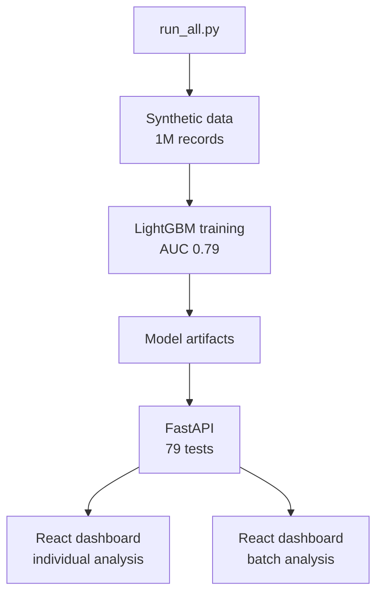

# Credit Risk Case Study

[](https://www.python.org/)
[](https://fastapi.tiangolo.com/)
[](https://react.dev/)
[](https://www.typescriptlang.org/)
[](https://lightgbm.readthedocs.io/)
[](/api/tests)

---

## Overview

This is an end-to-end credit risk case study: a LightGBM classifier (AUC 0.79) served
through a FastAPI backend, with a React + TypeScript dashboard for individual and
batch credit analysis. It models pricing logic based on Brazilian banking regulation
(CMN Resolution 2.682/99).

**Context:** built as the case-study deliverable for Santander Brasil's Data Master
program, a selective internal data program with a qualifying exam followed by an
end-to-end case presented to an evaluation panel. This repository is a demonstration
project, not a deployed production system.

### At a glance

| Automation | ML Model | API | Dashboard | Regulation |
|:---:|:---:|:---:|:---:|:---:|
| `run_all.py`, one-command setup | LightGBM, AUC 0.79 | FastAPI, 79 tests | React + TS | BACEN Res. 2.682/99 |

---

## Demo

### Individual analysis, approved


### Individual analysis, denied


### Batch analysis


Batch processing of multiple credit proposals via CSV upload.

---

## What it does

| Component | What it covers |
|:---|:---|
| **Automated setup** | `run_all.py` generates synthetic data, trains the model, builds the dashboard, runs the test suite, and starts both services, in one command. |
| **Rate logic** | Calculates a minimum profitable rate per proposal based on BACEN-related provisioning rules, so a proposal below that threshold is flagged. |
| **Test suite** | 79 automated tests (Pytest) covering the API layer. |
| **Model** | LightGBM classifier, trained on 1M synthetic records, AUC 0.79. |
| **Regulatory logic** | Provisioning and rate calculations modeled on CMN Resolution 2.682/99. |

---

## Architecture


```mermaid
graph TB
    A[run_all.py] --> B[Synthetic data<br/>1M records]
    B --> C[LightGBM training<br/>AUC 0.79]
    C --> D[Model artifacts]
    D --> E[FastAPI<br/>79 tests]
    E --> F[React dashboard<br/>individual analysis]
    E --> G[React dashboard<br/>batch analysis]
```

<details>
<summary>Component breakdown</summary>

| Component | Technology | Role |
|:---|:---|:---|
| Prediction API | FastAPI | Orchestrates the prediction flow, applies business rules, serves the model. |
| Dashboard | React (Vite) + TypeScript | Interface for individual and batch credit analysis. |
| Risk model | LightGBM | Credit risk classification. |
| Tests | Pytest | 79 tests covering the API. |
| Automation script | Python | Orchestrates setup, data generation, training, and service startup. |

</details>

---

## Minimum profitable rate

The system calculates a minimum profitable rate per proposal, based on CMN Resolution
2.682/99:

```math
Required\ Revenue = CDI + BACEN\ Provisioning + Operating\ Costs + Minimum\ Margin
```

- **CDI**: the bank's cost of funding
- **BACEN Provisioning**: mandatory provisioning percentage by risk level (Res. 2.682/99)
- **Operating Costs**: administrative, tech, and personnel overhead
- **Minimum Margin**: minimum expected return

---

## Running it locally

<details>
<summary>Setup instructions</summary>

### Requirements
- Python 3.11+
- Node.js 18+

### One-command run

```bash
# Linux / macOS
python3 run_all.py

# Windows
python run_all.py
```

This generates the synthetic dataset, trains the model, builds the dashboard, runs
the test suite, and starts both services.

### Access points

| Service | URL |
|:---|:---|
| API Docs (Swagger) | http://localhost:8000/docs |
| Dashboard | http://localhost:3000 |
| Health Check | http://localhost:8000/health |

</details>

---

## Screenshots

### Batch analysis, interface


### Batch analysis, results


---

## Possible next steps

- CI/CD with GitHub Actions
- Airflow for periodic retraining
- Cloud deployment (Terraform, Kubernetes) if this ever moved beyond a case study
- Data/concept drift monitoring

---

## Additional docs

- [`docs/BACEN_2682_Criterios_Risco.md`](https://github.com/felipesbonatti/case-credit-risk-prediction/blob/main/docs/BACEN_2682_Criterios_Risco.md)
- [`docs/Santander_Criterios_Score.md`](https://github.com/felipesbonatti/case-credit-risk-prediction/blob/main/docs/Santander_Criterios_Score.md)
- [`api/tests/`](https://github.com/felipesbonatti/case-credit-risk-prediction/tree/main/api/tests)
- [`api/app/services/model_service.py`](https://github.com/felipesbonatti/case-credit-risk-prediction/blob/main/api/app/services/model_service.py)

